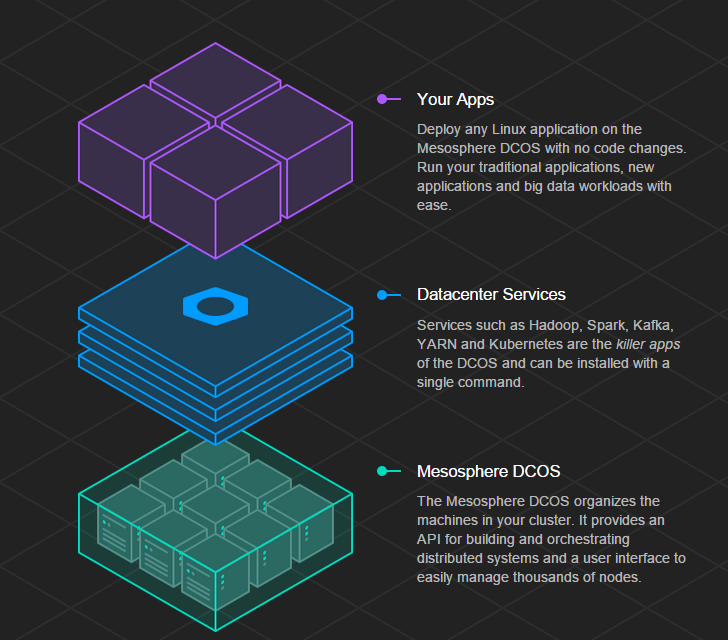

<h1>Report on Mesosphere DCOS</h1>

<h3>What is Mesosphere?</h3>
* Mesosphere is an implementation of the platform as a service paradigm. It is a data center operating system, used to manage the entire data center as if it is a single computer.
* It provides a highly elastic, and highly scalable way of deploying applications, services and big data infrastructure on shared resources. 
* It takes care of deploying different applications on different nodes in our data center cluster.The DCOS can be used to launch thousands of containers in seconds, or deploy complex systems like Hadoop with a single command.
* Mesosphere enables a way to easily scale applications by abstracting away many of the challenges associated with scaling.
 

<h3>Mesosphere architecture</h3>
* Marathon 
The Marathon framework works as an 'init system' for Mesosphere. It starts all the applications and monitors them, while healing any failures it comes across. It has two important advantages from DevOps point of view:
  * Rolling restart: While restarting a service, it is ensured that it is running on at least a few nodes at any instance of time. Dynamic reconfiguration of load balancer is done to handle tasks being run on the nodes which are going to be restarted
  * Rolling upgrade: Done in the similar manner as rolling requests. Health-check is also done by Marathon, the thresholds for various metrics can be specified initially
* Mesos 
Mesos is the distributed systems kernel at the core. It manages the hardware resources such as CPU utilization etc, and provides this information to the frameworks.
* Service discovery 
Multiple applications can be run using Mesosphere and the apps need a way to communicate with each other. Mesos-DNS can be used for service discovery throught the domain name system.
* Zookeeper 
Zookeeper is the software that is used to coordinate the master nodes. There can be multiple master nodes, and the process of electing a master is coordinated by Zookeeper

<h3> Mesosphere terminologies</h3>
* Datacenter Operating System (DCOS) 
It is a new kind of Operating System that spans all machines in the datacenter or cloud and makes them act as one.
* DCOS cluster 
It is a group of nodes
* DCOS service 
There are various datacenter services installable from Mesosphere repository
* Framework 
Framework is a software that runs on top of Mesos. Each framewrok has its own scheduler and executor.
* Scheduler 
A framework's scheduler handles the deployment scheduling policies and resource assignment of tasks
* Executor 
Executor is the part of the framework that actually performs the tasks on the slave nodes
* Master 
It Aggregates resource offers from slaves and provides them to frameworks
* Slave 
Runs a discrete Mesos task on behalf of a framework
* Offers 
Offers are the available resources that the slave offers

<h3> Mesosphere terminologies</h3>
* Application scheduling & scaling 
* Fault-tolerance and self-healing of applications 
* Application prioritization under load 
* Application Service port unification 
* Application service discovery 
* Service end-point elasticity for applications 

<h3> Mesosphere terminologies</h3>
Mesosphere DCOS has the following limitaions for the community edition
* Must be run on supported cloud provider (eg, AWS) 
* Cannot be run on premise 
* Mesosphere only suports DCOS CE through community support channels, (eg Slack, Stack Overflow) 
* Cannot be provisioned into an existing VPC 
* Only supports AWS CloudFormation template in default config 
* Cannot run inside VPC over multiple availability zones 

